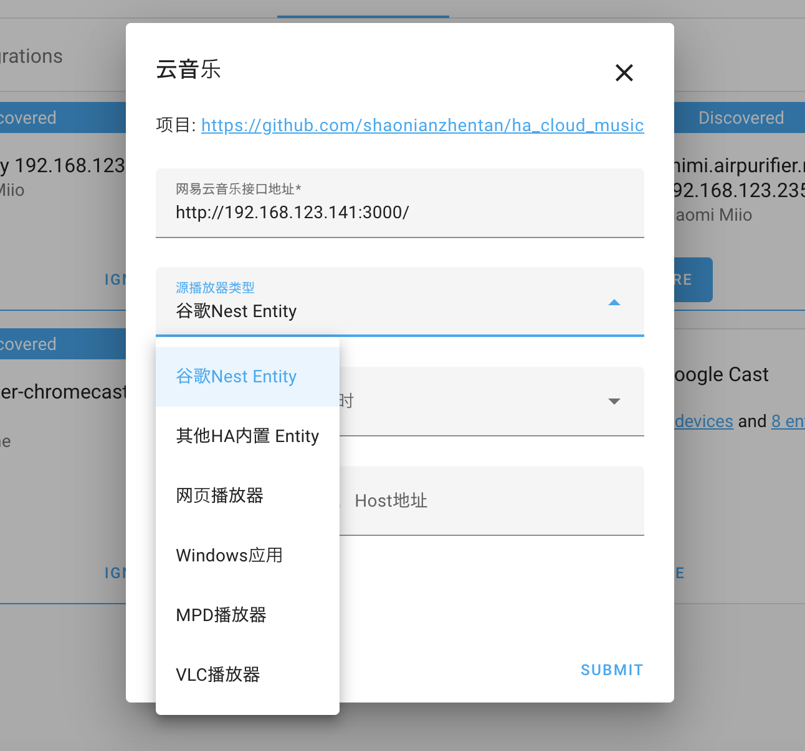
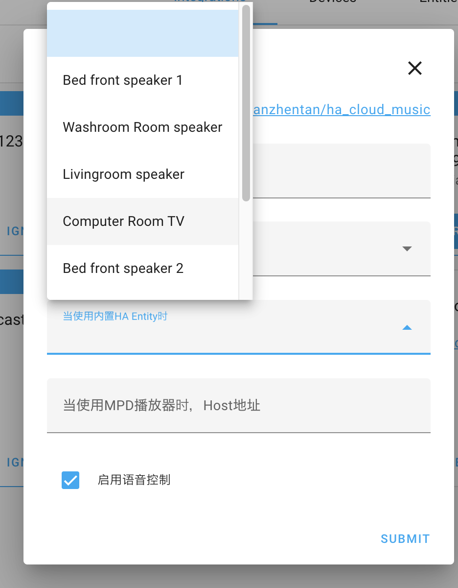
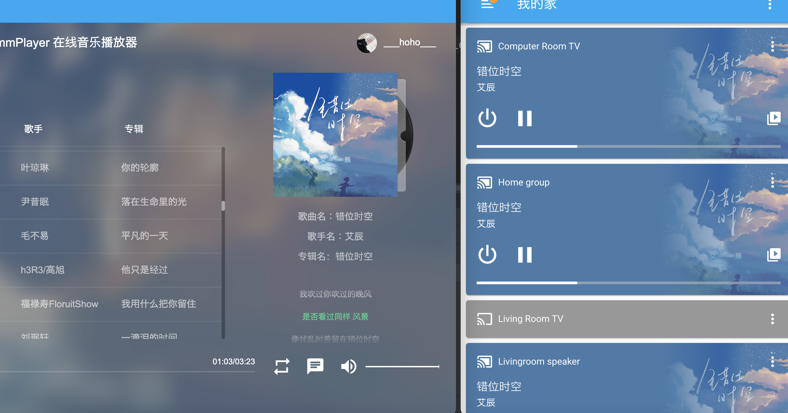

# 网易云HA插件

Fork from https://github.com/shaonianzhentan/ha_cloud_music

## 修改内容

> 已针对Chromecast的Google Home/Nest/TV 设备播放修复功能并优化

> 保持原有Repo中所有功能

## 详细
设置时支持所有播放器，其中例如VLC等部分播放器中代码参数没有文档没有提取

支持Chromecast等HA中Media Player选择

当选择Chromecast作为播放器时，增加音乐元信息推送，显示在HA中及带屏幕的Google设备

## TODO

- [ ] 顺序、随机、循环播放修复
- [ ] Google Home语音控制